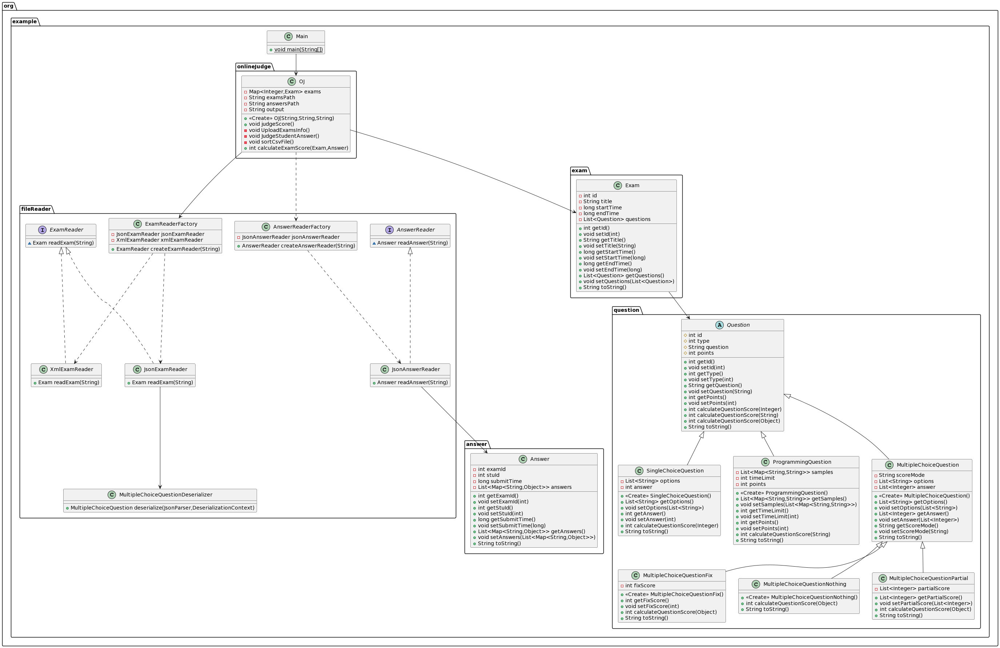

# 软件系统设计作业-迭代一

> 211250085-孙顾燚

[TOC]

## 1. 系统概述

本系统是一个在线评测系统，主要用于自动评判学生的考试答案并计算得分。

## 2. 系统架构

系统主要由以下几个部分组成：

- `OJ`类：这是系统的核心类，负责读取考试信息，判分学生答案，并将结果排序后写入CSV文件。

- `Exam`类：代表一场考试，包含考试的相关信息。

- `Answer`类：代表学生的答案，包含答案的相关信息。

- `Question`类：代表一道题目，包含题目的相关信息。

- `ExamReader`和`AnswerReader`接口：这两个接口定义了读取考试和答案的方法。系统提供了`ExamReaderFactory`和`AnswerReaderFactory`工厂类，可以根据文件扩展名动态地创建不同类型的`ExamReader`和`AnswerReader`。

下面是系统的UML类图

## 3. 类设计

### 3.1 `OJ`类

`OJ`类是系统的核心类，包含以下方法：

- `judgeScore()`：这是公开的方法，用于启动整个评判流程。

- `UploadExamsInfo()`：这是私有的方法，用于读取考试信息。

- `JudgeStudentAnswer()`：这是私有的方法，用于判分学生答案。

- `sortCsvFile()`：这是私有的方法，用于将结果排序后写入CSV文件。

- `calculateExamScore(Exam exam, Answer answer)`：这是私有的方法，用于计算一场考试的得分。

### 3.2 `Exam`类

`Exam`类代表一场考试，包含考试的相关信息。

### 3.3 `Answer`类

`Answer`类代表学生的答案，包含答案的相关信息。

### 3.4 `Question`类

`Question`类代表一道题目，包含题目的相关信息。它包含题目的基本信息，如题目的ID、题目的描述、题目的分值等。此外，它还定义了一个抽象方法calculateQuestionScore()，用于计算学生的答案得分。具体的题目类型（如选择题、编程题等）应该继承Question类，并实现calculateQuestionScore()方法。

### 3.5 `ExamReader`和`AnswerReader`接口

`ExamReader`和`AnswerReader`接口定义了读取考试和答案的方法。系统提供了`ExamReaderFactory`和`AnswerReaderFactory`工厂类，可以根据文件扩展名动态地创建不同类型的`ExamReader`和`AnswerReader`。

## 4. 系统流程

系统的主要流程如下：

1. 读取考试信息。

2. 判分学生答案。

3. 将结果排序后写入CSV文件。
