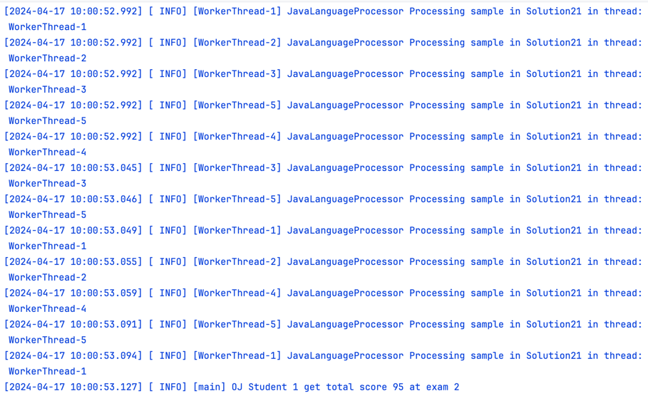
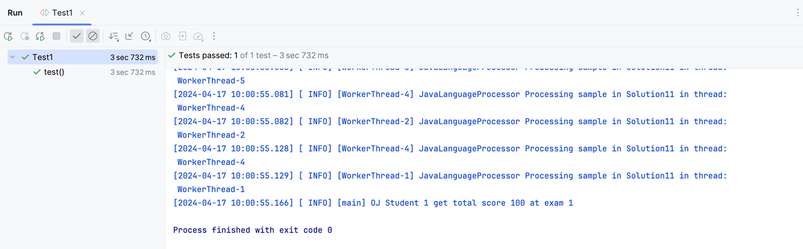

# 软件系统设计作业-迭代二

> 211250085 孙顾燚

[TOC]

## 1. 系统概述

在迭代二中，我们对在线评测系统进行了一系列的优化和扩展。主要的改进包括支持编程题类型，引入线程池以提高系统性能。

## 2. 新增和改进的功能

### 2.1 支持编程题类型

在迭代二中，我们增加了对编程题类型的支持。我们创建了一个新的`ProgrammingQuestion`类，该类继承自`Question`类，并实现了相应的评分方法。评分方法主要根据学生的代码执行结果和预期结果进行比较，如果一致则得满分，否则得零分。

为了支持不同的编程语言，我们创建了一个`LanguageProcessorFactory`类，该类可以根据编程语言的名称创建相应的`LanguageProcessor`。目前，我们只支持Java语言，所以`LanguageProcessorFactory`只能创建`JavaLanguageProcessor`，但是Factory类和LanguageProcessor接口为以后支持不同的编程语言提供了拓展的支持，符合开闭原则。

`JavaLanguageProcessor`类负责编译学生的代码和计算问题的得分。它首先使用`javac`命令编译学生的代码，然后使用`java`命令运行编译后的代码，并获取程序的输出。最后，它将程序的输出与预期的输出进行比较，如果一致则得满分，否则得零分。

### 2.2 引入线程池

为了提高系统的性能，我们手动实现了一个线程池来并行处理多个任务。我们创建了一个`ThreadPool`类，该类创建了一个`BlockingQueue`来存储待执行的任务，以及一个`WorkerThread`数组来执行这些任务。当有新的任务时，如果线程池中有空闲的线程，就会立即执行该任务；如果没有空闲的线程，就会将该任务放入`taskQueue`，等待有线程空闲时再执行。

`ThreadPool`类的主要组成部分如下：

- `numThreads`：线程池中的线程数量，按照题目说明设置为5。
- `threads`：一个`WorkerThread`数组，每个`WorkerThread`都会无限循环地从`taskQueue`中取出任务并执行。
- `taskQueue`：一个`BlockingQueue`，用于存储待执行的任务。

`ThreadPool`类的主要方法如下：

- `submit(Callable<T> task)`：将新的任务添加到`taskQueue`中。这个方法接受一个`Callable`任务，创建一个`FutureTask`，并将其添加到`taskQueue`中。

在`JavaLanguageProcessor`类中，我们使用线程池来并行处理每个样例。对于每个样例，我们创建一个`Callable`任务，该任务负责运行编译后的代码并比较输出结果。然后，我们将这个任务提交到线程池。当所有任务都完成时，我们检查每个任务的结果，如果所有任务都成功，那么学生的答案就得满分，否则得零分。

#### 2.2.1 线程池效果

通过打印日志，可以看到在编程题判分时，确实进行了并发操作。

### 2.3 对于迭代一的修改

#### 2.3.1

对于题目的判分，迭代一中对于不同的题目设置了不同的参数类型的判断分数的函数，但是这样系统的复杂度过高，在迭代二中，统一使用Object answer为参数，通过传入的参数类型来判断。计划在迭代三中进一步转为策略模式实现，降低系统的复杂度和耦合性。

#### 2.3.2

将文件读取的简单工厂模式改为抽象工厂模式，更好地支持开闭原则，降低了系统的耦合度。

## 3.迭代二类图

## 4.结果验证

运行测试均通过

